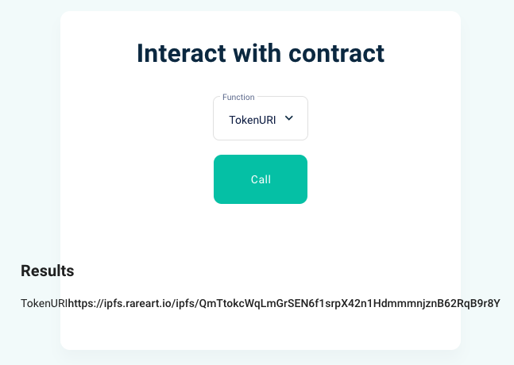
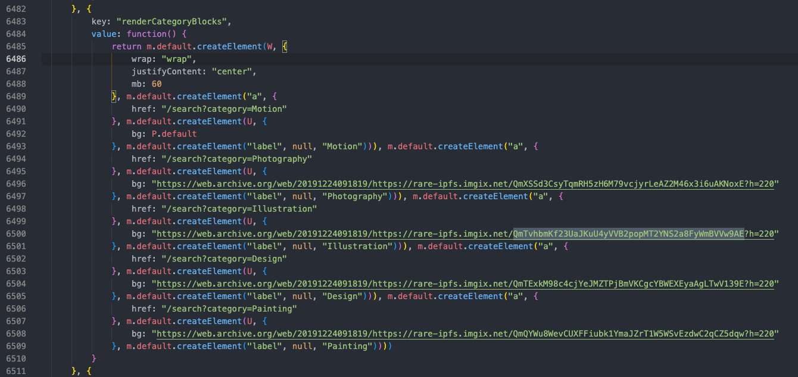
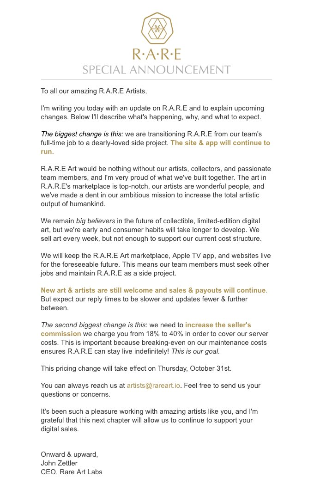

# R.A.R.E. Art Labs

When doing some research (some people call it "NFT archeology") I stumbled upon an art platform called [RARE Art Labs](https://rareart.io) which stored their artwork on the Ethereum blockchain.

I heard [XCOPY](https://twitter.com/XCOPYART) made some pieces a long time ago that were lost because of the website going down (it also caused the IPFS data to disappear).

So the digging began...

---

## ⛏ Digging

The first question I had was "how many artworks were minted through Rare Art Labs and are now lost?".
I needed to lookup what address created the token contracts and eventually found [this one 0x9068249ab8b6e9da80ac08a0e5d96dd13a139e26](https://etherscan.io/address/0x9068249ab8b6e9da80ac08a0e5d96dd13a139e26)

I quickly realized the `0x29814dd4` method was to create the token contracts. So when looking at [the first token created](https://etherscan.io/tx/0xc6ea08da94bda1d8bbac2ad3405cb9efbca65fc2f02c245157abaef189f792b8) on May 5th, 2018 you can see this was the data submitted in the tx (split by lines of 64 bytes)

| Hex data | Decoded value |
|---|---|
| 0x29814dd4 | unkown method name |
| 0000000000000000000000000000000000000000000000000000000000000080 | 128 |
| 000000000000000000000000000000000000000000000000000000000000000f | 15 |
| 00000000000000000000000000000000000000000000000000000000000000c0 | 192 |
| 00000000000000000000000064098c9a6ba2e0e00da0c6ed28c56ec26280af20 | 0x64098c9a6ba2e0e00da0c6ed28c56ec26280af20 (creator address) |
| 000000000000000000000000000000000000000000000000000000000000000c | 12 |
| 47656e65736973204d6174740000000000000000000000000000000000000000 | "Genesis Matt"  |
| 000000000000000000000000000000000000000000000000000000000000004b | 75 |
| 68747470733a2f2f697066732e726172656172742e696f2f697066732f516d51 | \ |
| 4148515251557955517a45767a34566b45754b74657047316f76717452436e70 |  -> https://ipfs.rareart.io/ipfs/QmQAHQRQUyUQzEvz4VkEuKtepG1ovqtRCnphgSgRaD3HNd |
| 6867536752614433484e64000000000000000000000000000000000000000000 | / | 

And if you look at the transaction logs you will see the address of the contract that was just created:

```
0x000000000000000000000000a6dc8b9f60b6ff2555a62cdc6acf792c4cb85948
```

So a token called "Genesis Matt" was created, with a supply of 15. See
[Genesis Matt token contract "0xa6dc8b9f60b6ff2555a62cdc6acf792c4cb85948" on etherscan](https://etherscan.io/address/0xa6dc8b9f60b6ff2555a62cdc6acf792c4cb85948)

Next, I downloaded an export of all transactions from the address `0x9068249ab8b6e9da80ac08a0e5d96dd13a139e26` and wrote a script to get all token contracts from those transactions.

After that I was searching the [Web Archive](https://web.archive.org) for any additional data. Luckily a couple of files were archived and I was able to find some JavaScript and additional data of the original rareart.io website.

I also managed to extract the token ABI (which is stored in `abis/ERC20token.json`).
With this information I was able to extract the name, supply and IPFS information of all the Rare Art artworks 💪

---

## 🏞 Artwork 

The most important part is the artwork itself of course!!

I've made [a big ass Google Docs Spreadsheet](https://docs.google.com/spreadsheets/d/1IJe_mwLRAO_dTu8J4lTKCFgbjEtDFLBWbGunyLW3TOU/edit?usp=sharing) to keep track of the artwork I found at the various social channels (see links below)

If the "type" column is filled it means I could find an artwork for the specific piece. So you can take the "name" column and you can extend it with the "type" column to find the corresponding artwork in the `img/artwork` folder.
For example "Worthless Redux" + "jpg" becomes "Worthless Redux.jpg"

---

## 📜 IPFS data

So at this point it was obviously to me that all IPFS data was lost.. *However* the IPFS hashes were stored in the token contracts, so there's still hope someone has the originals and can host them again!

It looks like there were 2 IPFS domains that were being used

* rare-ipfs.imgix.net
* ipfs.rareart.io

## ⭐️ Highlighted artworks

I talked to a couple of people on Twitter about the images and IPFS data. I also helped a few recovering their ETH that was still stuck within the RARE exchange contract.

---

### Worthless Redux - Brian Romero

The contract address for this token is [0x64F86775cbFa5398324fA7759D01fB9C1D134979](https://etherscan.io/address/0x64F86775cbFa5398324fA7759D01fB9C1D134979)

The ABI that comes with this contract is `abis/ERC20Token.json`. This way you can get all the on-chain information about the token.

I was lucky that legendary collector [zaphodok](https://twitter.com/zaphodok) saved all the images and he was kind to share them with me.
So this is the original artwork (which was hosted at IPFS at the time). The hash of the artwork is `QmTvhbmKf23UaJKuU4yVVB2popMT2YNS2a8FyWmBVVw9AE`


You can get the IPFS hash by installing the IPFS tools and run this command the following command in the terminal. For more info [see this page](https://github.com/ipfs/ipfs-docs/blob/main/docs/reference/kubo/cli.md)

```bash
ipfs add --only-hash Worthless\ Redux.jpg
```
You will see the output is like this:
```bash
added QmTvhbmKf23UaJKuU4yVVB2popMT2YNS2a8FyWmBVVw9AE Worthless Redux.jpg
 6.15 MiB / 6.15 MiB [=======================================================] 100.00%
```
So, this is the hash of the original artwork. 

**HOWEVER** the IPFS link that is in the contract is different from this. If you get the on-chain info, you get this link


The hash that it returns is `QmTtokcWqLmGrSEN6f1srpX42n1HdmmmnjznB62RqB9r8Y`. So what is this hash? Is it maybe a JSON file with more information than just the image? I don't know (yet)..

When searching for the old RareArtLabs website on the [Web Archive](https://web.archive.org/web/20191224091819/https://rareart.io/app.js) I stumbled upon a piece of JavaScript that did have the original `QmTvhbmKf23UaJKuU4yVVB2popMT2YNS2a8FyWmBVVw9AE` hash in the source though (see highlighted line).
So it definitely existed!!!



I also found an old interview with Brian, that was [still online at cloudfront](https://d3n32ilufxuvd1.cloudfront.net/5a8234d587f18028e9b060cf/1012790/body-eba8a630-888f-11e9-bef5-a5485d403fe7.html)

---

### Death Wannabe - XCOPY

In [his tumblr post](https://xcopy.tumblr.com/post/178351042374/death-wannabe-only-available-on-rare-art-labs) XCOPY shared the artwork for his Death Wannabe piece (10 editions). 

The token contract for this artwork is [0xF7CdE84938B9Bcbc5783cAC37270B6d5BC5FABdC](https://etherscan.io/address/0xf7cde84938b9bcbc5783cac37270b6d5bc5fabdc)


When querying the on-chain data of the token the IPFS link that's returned is this 

```
https://ipfs.rareart.io/ipfs/QmU6YF55nVm5oxiSp3qUJEFYA3Wm3RsLzy2X2GL4h4vyUF
```

If you run the IPFS command to see what hash it outputs you'll see that also doesn't match

ipfs add --only-hash Death\ Wannabe.gif

```bash
added Qma4psob4Rta2Azgg9ssTpiATZoKHmapUZWB67cbeYdHGt Death Wannabe.gif
 1.55 MiB / 1.55 MiB [=======================================================] 100.00%
```
This token originally had a supply of 10, but [6 got burned](https://etherscan.io/tx/0x4c1ea55df10f5d648e9faf76484891a29af5ed9505dd39d1586e55e5c8c04147), leaving a supply of only 4

There was also this wrapped token that Felblob had for a while, see [this link](https://ipfs.io/ipfs/Qmdh7hCDfLbCctjDYVoxoduyDPUQLrp24AXGkzDHKGNU5G) for more info. The buyer purchased the original ERC20 token and they burned the wrapper.

---

### The Day We've All Been Waiting For - Coldie


Another remarkable piece is this one from Coldie (nowadays a well known artist which also was pioneering with art on the blockchain back in the day).

This piece supposedly hangs in the Coinbase HQ. It was his genesis piece on Rare Art Labs.

on-chain IPFS hash `Qma22F4pV5j6z1bs1gW4h95pGa5RVQ7bmR83gtgRumZvrF`

```bash
ipfs add --only-hash The\ Day\ We\'ve\ All\ Been\ Waiting\ For.jpg 
added QmQD29u9KeDyoS5yG4he4YBxoh1ffStWXz3tqVdHm3F68K The Day We've All Been Waiting For.jpg
 1.52 MiB / 1.52 MiB [=======================================================] 100.00%
```
This probably is a too low resolution file so it wouldn't even be an original IPFS hosted image.

[Rare Art Labs tweet about the piece](https://twitter.com/rareartlabs/status/1156010281308344320)

His original user profile was [at this url](https://www.rareart.io/u/Coldie/artworks)


---

## ☠️ The end of R.A.R.E. Art Labs

I was able to get an email preview from Rare Art Labs.
In this email they wrote
```
we need to increase the seller's commission we charge you from 18% to 40% in order to cover our server costs.
```

Coldie wrote [in his article](https://coldie3d.com/proof-of-work-genesis)
```
On October 30, 2019 I made the decision to burn all tokens on R.A.R.E Art Labs that had not been sold. This came in response to the platform changing their sales commission to 40% as well as being ERC-20 tokens that were not the now adopted ERC-721 standard.
```

The announcement:



---

## RARE multisig wallet
The multisig wallet that holds most of the tokens is this one [0x2a5283380e4bbd35339b06aab87304b3237ff270](https://etherscan.io/tokenholdings?a=0x2a5283380e4bbd35339b06aab87304b3237ff270)

---

## Vending machine / exchange contracts

One of the vending machines / exchange contracts is [0xb5a4d58c047ba782f54e1febe4833a11e2b228e0](https://etherscan.io/address/0xb5a4d58c047ba782f54e1febe4833a11e2b228e0).

The ABI that comes with it is `abis/RareExchange.json`
If you're interesteg in the Solidity source, I was able to recover a part from it, see `contracts/RareExchange.sol`

You can use this ABI to interact with the contract through [https://www.myetherwallet.com/wallet/interact](https://www.myetherwallet.com/wallet/interact) for example.

---

## 💬 Social channels

* [Twitter](https://twitter.com/rareartlabs)
* [Pinterest](https://in.pinterest.com/rareartworks/)
* [Instagram](https://www.instagram.com/rareart.io/)
* [Crunchbase](https://www.crunchbase.com/organization/r-a-r-e-art)
* [LinkedIn](https://www.linkedin.com/company/rareartlabs/)
* [Facebook](https://www.facebook.com/rareartlabs)
* [Github](https://github.com/rareartlabs)

---

## 🙏 Special thanks

* [Felblob](https://twitter.com/felblob)
* [zaphodok](https://twitter.com/zaphodok)
* [XCOPY](https://twitter.com/XCOPYART)
* [Matt Mills](https://twitter.com/mattmillsart)
* [Brian Romero](https://twitter.com/brianromero)
* [Coldie](https://twitter.com/Coldie)
* [Kevin Trinh](https://twitter.com/kevkevtrinh)